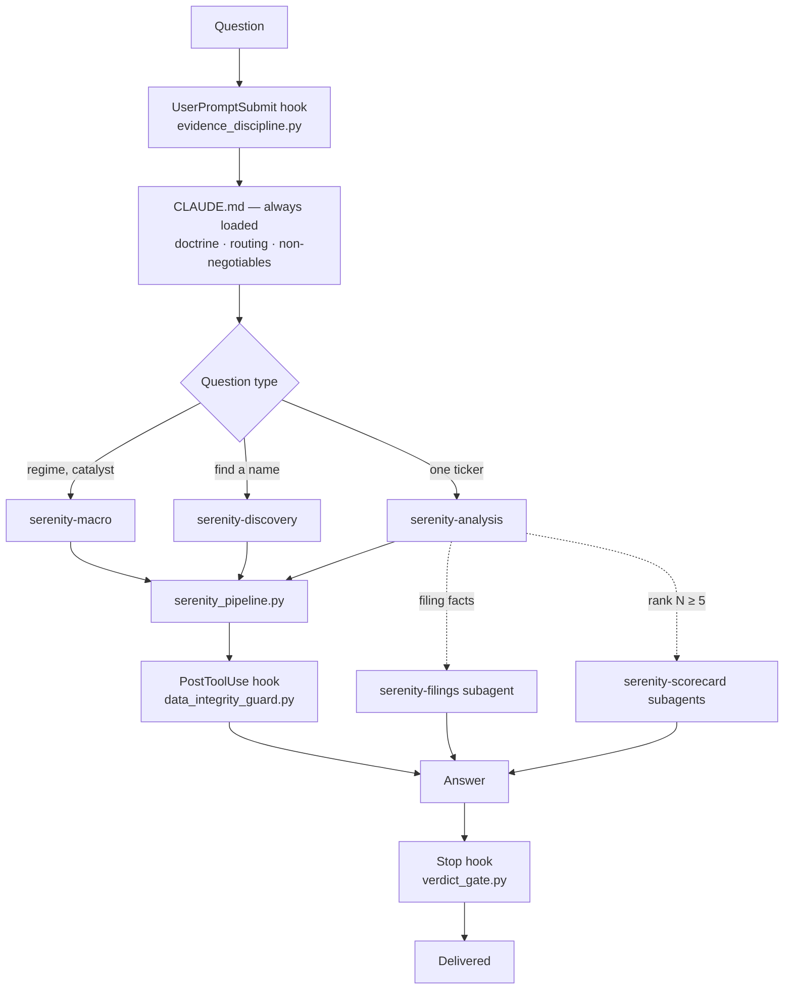

# Agent Harness

The judgment layer: the always-on spine, three on-demand skills, two subagents, and the protocol
that makes a multi-name ranking repeatable. None of this is required to use the pipeline — it
activates when the repository is opened in an agent runtime that reads `CLAUDE.md`.

## Why a harness rather than a prompt

A single long prompt has three failure modes this structure is built against:

1. **Everything competes for attention.** Detail needed for one question type dilutes every other
   question type. Splitting into on-demand skills keeps the always-loaded portion small without
   losing depth.
2. **Advisory rules get skipped under output pressure.** A model producing a long answer will drop
   a step it "knows" when the answer is already long. Hooks fire regardless of how the generation
   is going — that is precisely why the enforcement points are hooks and not more prose.
3. **Context floods.** A full 10-K read consumes an enormous amount of context that the main
   reasoning does not need. Subagents run in their own window and return only the extract.

## The layers



---

## The spine — `CLAUDE.md`

Always in context. Symlinked as `AGENTS.md` so both the Claude Code and Codex conventions load
the same file with no drift.

It holds only what every question needs:

| Section | Contains |
| --- | --- |
| Opening stance | The analytical move applied to every question, and the three shapes of concentration |
| Voice | How answers read — tone, hedging, sign-off requirements |
| Code loads facts, you judge | The boundary, restated where it cannot be missed, plus the pipeline commands |
| Bedrock — six roots | The first principles everything operational derives from |
| Ten values | The same roots at closer range, with an explicit precedence order for conflicts |
| One funnel, many entry points | Routing: which question type enters the funnel where |
| Which lens to open | When to load each skill |
| How the answer reads | The output contract per question type |
| The session archive | Persistence rules |
| Non-negotiables | Ten invariants that cause irreversible error when broken |

Two structural features are worth borrowing regardless of domain.

**Explicit conflict precedence.** The ten values carry a stated priority order, so two rules
pulling opposite ways resolve deterministically rather than by whichever the model weighted more
that run. Intellectual honesty ranks above everything; flow data ranks last. That ordering is
what stops an attractive setup from overriding a broken thesis.

**Reason from roots when no rule fits.** Six root principles sit above the operational rules, and
the spine directs reasoning back to them for unanticipated cases. This is a deliberate defense
against the alternative — appending a new rule per missed case, which grows the document without
covering the next one.

---

## Skills

Loaded on demand by description match. Each is a full method for one question type.

### `serenity-macro`

**Loads for:** regime reads, rates, liquidity, policy, geopolitics, and any catalyst or headline
assessment. Loads *first* whenever a question is macro **and** something else, so the regime
setting flows downstream into the single-name work.

Runs a four-step backbone: read the regime and set the aggression level → locate the name in the
CapEx cascade → run the catalyst test → route and size.

The catalyst test is the load-bearing move, and it is a single question: **does this event change
forward revenue?** Yes means reality moved and the name should re-rate. No means only sentiment
moved — which is either an opportunity or noise, but not a fundamental change. That one test
governs every headline, drop, and announcement.

Its headline invariant: *a fear dislocation and a genuine crisis produce an identical tape and
demand opposite responses.* Distinguishing them is the work.

### `serenity-discovery`

**Loads for:** finding a name rather than evaluating a named one — "what should I buy," a theme,
"the next X," "who benefits," or resolving a foreign winner to a US-listed expression.

Covers two axes, and most misses come from running only the first:

- **Vertical** — trace the chain downward: end product → integrator → major components →
  sub-components → raw materials → equipment → feedstock.
- **Horizontal** — transfer across to a comparable name that has not re-rated yet.

It also carries a quantified escalation trigger: discovery fires when a high-growth chain depends
on an input concentrated in a node (top-three supplier share above 70%) whose market cap is under
one-tenth of the target's. And a labeling discipline — a node reached by deduction is marked
deduced, and never carries the conviction of a confirmed one.

### `serenity-analysis`

The largest skill and the one a bare ticker routes to directly. Six sections:

| § | Covers |
| --- | --- |
| 0 | Name the archetype first, plus two preempting forks: a data-integrity check on the raw numbers, and a physical-feasibility test when the entry is a displacement or cancellation headline |
| 1 | Winner gates and moat — a chokepoint is not yet a winner |
| 2 | Valuation — picking the lens the structure demands, and running it |
| 3 | Cycle stage, the five-rung ladder, and the **rank-N protocol** |
| 4 | Entry, vehicle, kill signals, conviction dynamics |
| 5 | Loss-hardened gotchas |
| 6 | Building the answer — the output contract |

**§0's ordering is the point.** Before any archetype is assigned, two checks run on the raw
evidence. First, arithmetic identity on the numbers themselves — because a ticker collision or a
mis-tagged figure *is* the mispricing, and tagging an archetype on corrupt input produces a
confident wrong answer. Second, when the entry is a "customer dropped them" headline, the physical
feasibility of that claim is litigated before it may enter the bear case: an embedded-IP or
qualification-timeline fact can make near-term displacement impossible, which inverts the read
entirely.

**§2's rule is that naming a lens is not running it.** A lens is run only when driver arithmetic
appears with each input traced to a pipeline field. A verdict resting on the subject's own
top-down multiple is the consensus read the whole exercise measures against — unfinished, not
conservative.

---

## Subagents

Separate context windows. They return extracts, not conversations.

### `serenity-filings`

**Tools:** `Bash`, `Read`, `Grep` — deliberately no `Write`.

Reads 10-K, 10-Q, and 8-K filings and returns objective relationship facts with no judgment. It
is the **sole source** of structured disclosure numbers the income statement does not carry:
customer concentration percentages, geographic revenue split, inventory composition, purchase
obligations. The pipeline no longer ships these.

Five output buckets, each with the degree attached, plus two hard rules — quote and cite every
fact, and treat silence as `null` rather than zero. Full detail in
[Filings and SEC](Filings-and-SEC.md#what-the-subagent-brings-back).

The agent navigates adaptively but extracts through the deterministic CLI, so the figure is
reproducible even though an agent found it.

### `serenity-scorecard`

**Tools:** `Bash`, `Read`, `Grep`, `Write`.

Fills one name's scorecard as part of a multi-name ranking. Not a deep dive — a main-thread
single-name read goes considerably further. This produces the *uniform, comparable* unit that a
ranking is assembled from.

Its input line is fixed:

```
ticker: {T} | folder: sessions/{folder}/ | peers: {cohort tickers} | regime: {verbatim regime text}
```

Three constraints make the output comparable:

- **`peers` is for the comparator call only**, never for ranking. The agent does not know where
  its name should land.
- **`regime` is given, never re-fetched.** One macro read is shared across the whole cohort, so
  every scorecard is written against identical macro conditions.
- **The blindness rule** — it never reads any other session file, including prior sessions. Held
  by instruction rather than by toolset.

It writes `sessions/{folder}/{TICKER}.md` in the pinned schema and returns only the path plus one
standout fact.

**The scorecard schema** is pinned in the agent definition and is the single source of truth for
the format:

```markdown
---
ticker: NVDA
type: scorecard
session: 260718.rank-ai-supply-chain
date: 2026-07-18
data_as_of: 2026-07-18T09:32Z    # wall-clock of the pipeline run
archetype: chokepoint            # chokepoint | disruption | evolution | UNRESOLVED:<nulled line>
stage: 4                         # ladder rung 1-5
gates: pass                      # pass | fail:<gate> | conditional:<which> | blocked:<line>
conviction: high                 # this name's OWN, never cohort-relative
gate_strength: "…"
vehicle: "…"
mc: "$3.2T"                      # verbatim from key_facts
---
## Structural position
## Forward revenue trajectory
## Lens          — the literal Lens: line(s); BOTH legs on a forked lens
## Winner-gates
## Downsides     — 2-4 bullets, each tagged priced-in / addressed
## Falsifier     — "breaks if …"
```

There is deliberately **no `tier` field and no delta section**. Both belong to the synthesis step,
not to an individual scorecard — a scorecard that assigned its own tier would defeat the
cohort-independence the protocol depends on.

---

## The rank-N protocol

The fixed procedure for "rank these N names," designed so two runs on the same cohort produce
comparable output and every changed placement has a stated reason.

**Fixed:** the scorecard fields, the precedence, the tie-breaks, the tier vocabulary, the output
format. **Deliberately not fixed:** any threshold, weight, or formula that would assign a tier
automatically. A composite score here would be the removed legacy screen reappearing under a new
name.

### Step 1 — One scorecard per name

For N ≥ 5, one `serenity-scorecard` subagent per name, launched with the identical colorless
message shown above. No per-name hints — no "the obvious top pick," no "probably a pass." Macro
runs **once**, is written to `sessions/{folder}/_macro.md`, and is passed verbatim to every agent.

Under five names, the same schema is filled inline.

### Step 2 — Fixed precedence

Ranking reads from scorecard **frontmatter only**. Loading thirty full bodies into one context
recreates the attention-dilution problem the structure exists to avoid.

1. **Gates determine membership.** `fail` → excluded, with the failed gate named.
   `conditional:` ranks below every clean pass and cannot reach the top tier. `blocked:` → a
   separate "unresolved, needs a main-thread filings read" row.
2. **Cycle stage is the ordering spine.** A stage-5 name cannot enter the top two tiers.
3. **Within a rung:** gate strength first, then conviction.
4. **Tie-breaks, in order:** the floor leg's valuation gap as a fraction of current price, read
   off each name's own `Lens:` line; then vehicle practicality — liquidity, US-listing quality,
   implied-volatility tier.

If four steps cannot separate two names, they are **declared tied**. Inventing an order would
manufacture precision that the evidence does not support.

### Step 3 — Draft tiers, cohort-independent

Tiers are `1 (core)`, `2`, `3 (watch)`, `EXIT`, `EXCLUDED`, `UNRESOLVED`, with a visible
`Tier cut:` line stating where the boundaries fall and why.

### Step 4 — Reconcile against the prior ranking, only now

The ordering here is the entire point. Fresh judgment completes **before** the prior ranking is
opened; reading it first anchors the new assessment to the old conclusion.

Then: diff the regime first, reconcile only the overlapping names, and label every moved tier as
one of three things — an **evidence delta** (the facts changed), a **judgment revision** (the
same facts, read differently, owned as a revision), or a **cohort delta** (the name did not move;
the comparison set did).

> A tier that moved with no label is the exact failure this protocol exists to prevent — silent
> drift that looks like analysis.

### Step 5 — Archive, then answer

Write `_ranking.md` with the fixed table:

```markdown
| ticker | tier | rung | gates | one-line why |
```

Column order is exact, because `serenity_harness.py rankdiff` parses it. Add the `Tier cut:` line
and a `## Deltas vs {prior-folder}` section, update `sessions/INDEX.md`, and close the answer with
a visible `Saved:` line — which the `Stop` hook verifies actually points at a folder containing
Markdown files.

### Comparing two rankings

```bash
scripts/.venv/bin/python scripts/serenity_harness.py rankdiff \
  sessions/260701.ai-chain/_ranking.md \
  sessions/260718.ai-chain/_ranking.md
```

Returns the intersection, agreement percentage, per-ticker tier changes, names present in only
one, and whether the tier cut moved. Pure fact-loading — it diffs two files a human already wrote
— so it sits on the code side of the boundary.

---

## The Codex parity layer

`.codex/` mirrors the harness for the Codex convention:

| Path | Form |
| --- | --- |
| `.codex/skills` | **Symlink** to `.claude/skills` — content stays in sync automatically |
| `.codex/hooks` | **Symlink** to `.claude/hooks` |
| `.codex/agents/*.toml` | Manual translations of the `.md` agent definitions |
| `.codex/hooks.json` | Manual translation of the hook bindings |
| `AGENTS.md` | **Symlink** to `CLAUDE.md` |

Symlinks where the format allows it, translations only where it does not — so drift is possible
in exactly two files rather than across the whole tree.

> ⚠️ `.codex/hooks.json` currently points at an absolute path that does not exist on this machine,
> so the Codex hook bindings are inert. See
> [Known Limitations](Known-Limitations.md#codex-hook-layer-is-dead).

## The design record

`.claude/harness-spec.md` records what each component is and **why it sits in the layer it sits
in**, plus a dated change history noting what was deliberately *not* done and why. It is an audit
anchor rather than a runtime document — nothing loads it. When a component changes, it is updated
so the next audit has something to compare against.

---

**Next:** [Hooks Reference](Hooks-Reference.md) for the enforcement points, or
[Session Archive](Session-Archive.md) for persistence. · [Back to index](README.md)
