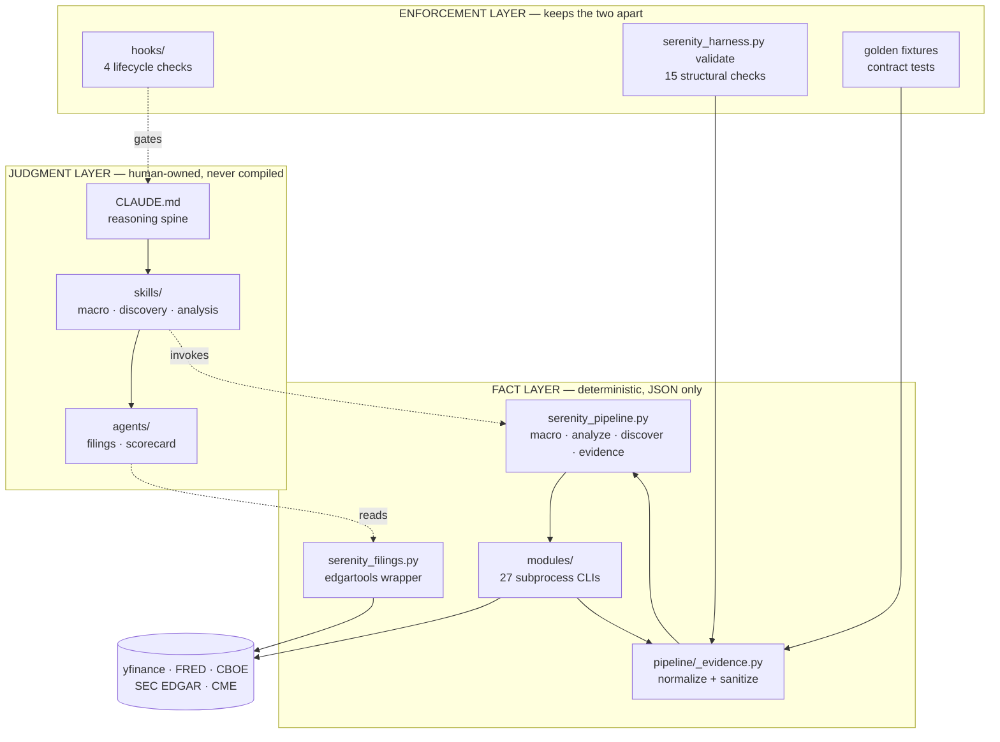
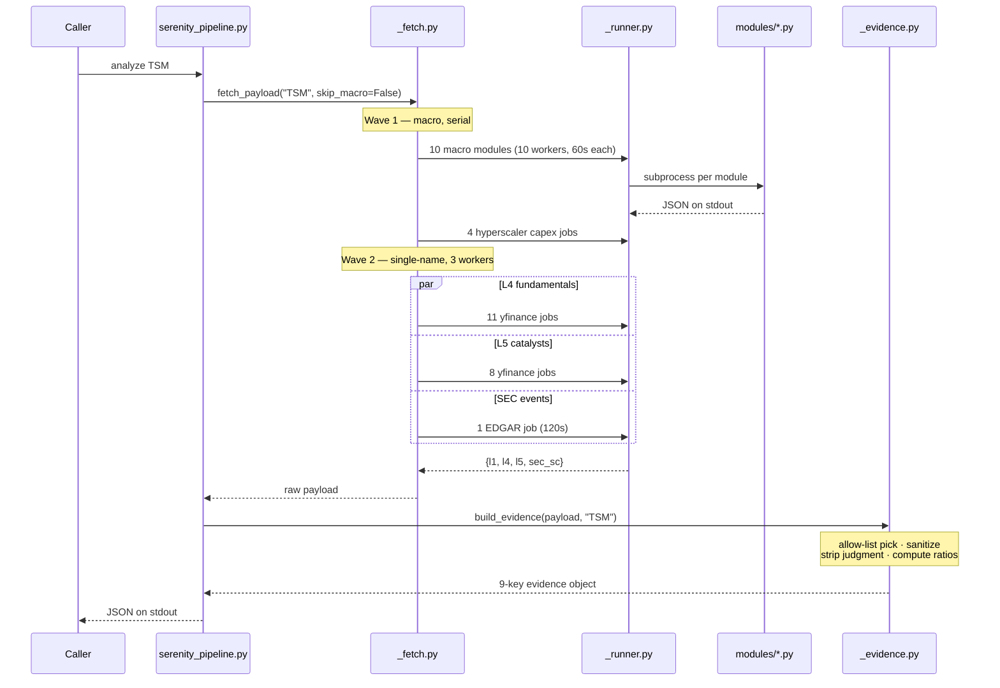

# Architecture

How the pieces fit, how a run flows through them, and why each boundary sits where it does.
Assumes the vocabulary in [Concepts](Concepts.md).

## The organizing invariant

> **Code loads facts. The analyst judges.**

Every structural decision below follows from it. Where the design looks over-engineered, the
question to ask is "what would leak across the boundary if this weren't here?" — that is usually
the answer.

## Layers

| Layer | Lives in | Owns | Why here |
| --- | --- | --- | --- |
| **Reasoning spine** | `CLAUDE.md` (symlinked as `AGENTS.md`) | Doctrine, routing, answer contract, non-negotiables | Always in context. Holds only what every question needs. |
| **Skills** | `.claude/skills/serenity-{macro,discovery,analysis}/` | Depth per question type | Loaded on demand. Keeps the spine small without losing detail. |
| **Subagents** | `.claude/agents/` | Filing reads, per-name scorecards | Separate context windows. A filing read should not flood the main reasoning context. |
| **Hooks** | `.claude/hooks/` | Runtime enforcement | Four lifecycle points where determinism is worth its cost. An advisory rule can be skipped under pressure; a hook fires regardless. |
| **Evidence pipeline** | `scripts/serenity_pipeline.py`, `scripts/pipeline/` | Fetch, normalize, contract-check | The only place market numbers enter the system. |
| **Data modules** | `scripts/modules/` (27 files) | One external source each | Process isolation: one dead upstream cannot take down a dossier. |
| **SEC layer** | `scripts/serenity_filings.py` | Filing numbers and text | Separate from the pipeline because filing reads are adaptive; the *numbers* still come from XBRL with the concept cited. |
| **Validation** | `scripts/serenity_harness.py` | Structural self-check | The mechanism that makes the boundary real rather than aspirational. |
| **Session archive** | `sessions/` | Persisted analysis | Judgment survives the session; numbers deliberately do not. |
| **Eval** | `scripts/serenity_eval.py`, `scripts/eval/` | Reproduction measurement | Answers "does the method actually survive?" — user-triggered only. |

## Component map



## How an `analyze` run flows



Concretely, `analyze TSM` runs roughly 34 subprocesses: 14 for macro (10 gauges, then 4
hyperscaler capex fetches in a second wave), 11 for fundamentals, 8 for catalysts, 1 for SEC
events. With `--skip-macro` the first 14 disappear, which is most of the wall-clock time.

### Why subprocesses instead of imports

Each module in `scripts/modules/` is a standalone argparse CLI invoked via
`subprocess.run([sys.executable, path, ...], timeout=60)`. That looks wasteful — process startup
per data point — and buys three things worth the cost:

1. **Fault isolation.** A module that hangs, segfaults, or leaks C-level state from a scraping
   library cannot affect the others. `_runner.py` converts every failure mode — non-zero exit,
   timeout, malformed JSON, any exception — into `{"error": "..."}` and returns normally. It never
   raises.
2. **Dependency isolation.** yfinance, `fredapi`, `edgartools`, and the vendored scraper libraries
   have overlapping and occasionally conflicting import-time behavior. Separate processes make
   that a non-issue.
3. **Testability.** Every module is independently runnable and inspectable:
   `scripts/.venv/bin/python scripts/modules/vix_curve.py analyze`.

### Degradation

There is no exception path from a module to the caller. A failure becomes a missing field:

```
module fails → {"error": "..."} → consumer guard `not d.get("error")` → field omitted
```

A ticker where every yfinance call fails still emits all nine top-level keys with empty
sub-objects. This is deliberate — partial evidence is usable, a crash is not — but it means **an
empty field is ambiguous**: it can mean "the filing was silent," "the fetch failed," or "the key
was missing." The method's response is that a null field is never a license to fill the value from
memory.

There is **no caching anywhere**. Every run re-fetches everything. `--skip-macro` is the only
reuse mechanism, and it is manual.

## The evidence builder

`scripts/pipeline/_evidence.py` is where raw fetch output becomes the contract-checked payload.
It does four things:

**1. Allow-list selection.** `_pick(source, (field, field, ...))` copies only named fields, and
**omits a key entirely when its value is `None`** rather than emitting `null`. This is why
`key_facts` is variable-arity — between 0 and 20 keys depending on what the source returned.

**2. Structural stripping.** Several modules produce interpretive labels alongside their
measurements. Those labels are simply not in the allow-list, so they never reach the output:

| Module produces | Emitted | Dropped |
| --- | --- | --- |
| `vix_curve.py` | `vix_spot`, `vix_structure` | `vix_regime` |
| `bdi.py` | `bdi_z_score` | `bdi_demand` |
| `dxy.py` | `dxy_z_score` | `dxy_strength` |
| `institutional_quality.py` | `{name, shares}` per holder | the holder classification labels |
| `actions.py` (insider) | the six count and value fields | `net_direction` |

**3. Active sanitization.** `_sanitize()` recursively removes forbidden keys and verdict-shaped
string values. It runs on `macro_inputs`, the one branch whose content is a pass-through dict
rather than an allow-listed pick.

**4. Derived arithmetic.** `ev_to_revenue`, `ev_to_fcf`, `net_debt` — pure ratios over disclosed
inputs. Note the deliberate asymmetry: `ev_to_fcf` is emitted only when free cash flow is
positive, because a negative multiple is a division artifact rather than a valuation signal.

## Why judgment does not live in code

The pipeline may emit market cap, price, multiples, margins, cash, debt, assets, inventory, macro
gauges, filing facts, and comparison metrics. It may not emit ratings, archetype tags, regime
labels, conviction scores, price targets, or vehicle recommendations.

The stakes are asymmetric. A wrong *number* is checkable — you can pull the source and compare. A
wrong *criterion* is invisible: it produces a plausible label, gets trusted because it came from
code, and inverts a conclusion with nothing to catch it. Worse, a score becomes a substitute for
reasoning; you defer to it and stop thinking.

This is not hypothetical here. See below.

## The legacy quarantine

`scripts/pipeline/legacy/` holds the pipeline as it was *before* the boundary was enforced —
roughly 2,500 lines that computed:

| Legacy output | What it decided |
| --- | --- |
| `_macro.py::_classify_macro_regime` | `regime` ∈ risk_on / risk_off / transitional, plus a risk level |
| `_health.py::_extract_health_gates` | 5 pass/caution/flag gates and a 0–5.0 severity score |
| `_signals.py::_build_objective_screen` | `screen_score` out of 60 (health 25 + momentum 15 + catalyst 10 + valuation 10) |
| `_signals.py::_classify_dilution` | `accounting_illusion` / `growth_dilution` / `value_destruction` / … |
| `_control.py::_build_priced_in_assessment` | a 0–100 `risk_score` plus `fully` / `partially` / `not_priced_in` |
| `_control.py::_build_expression_layer` | a `vehicle_menu` recommending cash-secured puts, LEAPS, covered calls |

Every one of those field names is now a literal member of `FORBIDDEN_EVIDENCE_KEYS`.

It was quarantined rather than deleted for two reasons: the golden-fixture capture path still
routes through it, and it documents precisely what was removed. Nothing on the live path imports
from it. The dependency runs strictly the other way — legacy imports two shared helpers
(`_bottleneck.py`, `_postprocess.py`) from the live package.

The validator asserts the quarantine holds: check `judgment_boundary` fails if any module matching
`pipeline.legacy` appears in `sys.modules` after a live import.

**Practically, legacy is vestigial.** Its LLM extraction path depends on a `sec-analyzer` editable
install pointing at a directory that no longer exists, and its golden-directory constant points at
a path that was never created. See [Known Limitations](Known-Limitations.md).

## The SEC split

Filing data is handled differently from market data, and the reason is worth stating.

Market numbers are **structurally uniform** — every company has a market cap in the same place, so
a fixed fetch-and-pick pipeline works. Filing content is **not**: customer concentration might be
in a revenue note, a risk factor, or a segment footnote, tagged differently by different filers.

So the split is:

- **Reading the filing** — locating disclosures, following cross-references, deciding which
  section answers the question — is adaptive work handled by the
  [`serenity-filings` subagent](Agent-Harness.md#serenity-filings).
- **Extracting the numbers** stays deterministic: the subagent calls `serenity_filings.py`, which
  pulls values through edgartools XBRL with the concept cited. The figure is reproducible even
  though an agent orchestrated the lookup.

An earlier design put an XBRL parser inside the pipeline. It was retired — it duplicated the
subagent and degraded silently on tag drift and EDGAR blocks, which is the worst failure mode
available: a null that looks like "the company doesn't disclose this." Its code survives as a
frozen reference at `scripts/pipeline/legacy/_sec_xbrl.py`, and the validator asserts it stays
unimported.

The consequence is that **`filing_evidence` is empty on the live path** — the in-pipeline fetch is
now a stub. Filing facts come from the subagent instead. See
[Known Limitations](Known-Limitations.md#filing_evidence-is-empty-on-the-live-path).

## Enforcement mechanisms

Four independent mechanisms hold the boundary, at different times:

| Mechanism | Runs at | Catches |
| --- | --- | --- |
| `_sanitize()` + allow-list picks | Every payload build | Judgment escaping into output |
| `serenity_harness.py validate` | On demand, and at session start | Structural regression across all 16 fixtures |
| `scripts/tests/test_evidence_contract.py` | Test time | The contract, including a deliberately poisoned synthetic payload |
| `.claude/hooks/verdict_gate.py` | Before an answer is delivered | An answer that skipped required reasoning steps |

Redundant on purpose. The sanitizer can be bypassed by a new code path that does not call it;
`validate` catches that on the next run. `validate` only sees fixtures; the runtime hook sees real
answers.

## Design decisions worth knowing

**Allow-lists, not deny-lists, for field selection.** A deny-list fails open — a new judgment field
in a module reaches output until someone bans it. The allow-list fails closed. The deny-lists
(`FORBIDDEN_*`) are a second layer for the one branch that must pass data through.

**Fixtures blessed from live captures, never hand-written.** Hand-typing an expected value bakes
in exactly the transcription error the fixture exists to catch.

**`discover` returns candidates in input order.** Sorting would be ranking, and ranking is a
judgment. The comparator normalizes and presents; ordering is yours.

**Hooks are wired in exec-form** (`command` plus an `args` array) rather than as a shell string.
Shell form let a shell-profile banner corrupt the stdout of a JSON-emitting hook, silently
no-oping it.

**`CLAUDE.md` is symlinked to `AGENTS.md`** so both the Claude Code and AGENTS conventions load the
same spine with no drift. A hand-translated `.codex/` parity layer was retired 2026-08-11 — see
[Agent Harness](Agent-Harness.md#the-agents-mirror).

## Directory reference

```
CLAUDE.md                     reasoning spine (AGENTS.md → symlink)
.claude/
  settings.json               hook wiring
  harness-spec.md             design record and change history
  skills/serenity-{macro,discovery,analysis}/SKILL.md
  agents/serenity-{filings,scorecard}.md
  hooks/                      lifecycle hooks + tests/ (fixtures + run_fixtures.py)
scripts/
  serenity_pipeline.py        main CLI (thin argparse shim)
  serenity_filings.py         SEC CLI
  serenity_harness.py         validate + rankdiff
  serenity_tweets.py          thesis DB query
  serenity_eval.py            reproduction measurement
  pipeline/
    _fetch.py                 orchestration and I/O
    _runner.py                subprocess boundary
    _evidence.py              normalize + contract enforce
    _bottleneck.py            filing dossier consolidation
    _postprocess.py           analyst-revision reshaping
    legacy/                   quarantined judgmentful pipeline
  modules/                    27 data-fetching CLIs
  tests/golden/               16 × (inputs, expected)
  eval/                       eval workflow
sessions/                     analysis archive
docs/wiki/                    these pages
data/analysis_Serenity.db     thesis DB (answer key)
```

---

**Next:** [Pipeline Reference](Pipeline-Reference.md) for the exact surface, or
[Agent Harness](Agent-Harness.md) for the judgment layer. · [Back to index](README.md)
