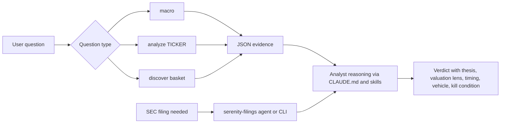

# Architecture

Harness of Serenity is organized around one invariant:

> Code loads facts. The analyst judges.

The architecture exists to keep deterministic evidence collection separate from market judgment.

## Layers

| Layer | Files | Responsibility |
| --- | --- | --- |
| Reasoning spine | `CLAUDE.md` | Always-on doctrine, voice, routing, answer contract, and non-negotiables. |
| Skills | `.claude/skills/serenity-*` | Focused depth for macro, discovery, and single-name analysis. |
| Filing agent | `.claude/agents/serenity-filings.md` | Objective SEC relationship facts, quoted and cited, without judgment. |
| Evidence pipeline | `scripts/serenity_pipeline.py`, `scripts/pipeline/` | JSON evidence from market, macro, filing, and fixture inputs. |
| Filing CLI | `scripts/serenity_filings.py` | Deterministic edgartools wrapper for SEC numbers and text. |
| Validation | `scripts/serenity_harness.py validate` | Structural self-check for the evidence/judgment boundary. |

## Data Flow



## Why Judgment Does Not Live In Code

The pipeline may emit:

- market cap
- price
- valuation multiples
- margins
- cash, debt, assets, inventory
- macro gauges
- filing facts
- regression evidence

The pipeline must not emit:

- buy or sell ratings
- archetype tags
- regime labels
- conviction scores
- target prices
- winner grades

That boundary is not aesthetic. It prevents one stale criterion in code from silently inverting a thesis.

## Runtime Vs Build-Time Files

Runtime surfaces are:

- `CLAUDE.md`
- `.claude/skills/*`
- `.claude/agents/serenity-filings.md`
- `scripts/`
- `data/analysis_Serenity.db` only when explicitly cross-validating past theses

Build-time references are kept as local-only scaffolding and are not published with the GitHub project.

## Validation Contract

Run:

```bash
scripts/.venv/bin/python scripts/serenity_harness.py validate
```

The validator checks that:

- required skills exist and have frontmatter
- the pipeline imports
- golden fixtures preserve evidence invariants
- forbidden judgment keys and values do not leak into evidence
- macro outputs stay as raw gauges
- the SEC layer remains consolidated to the filing reader
- hooks are wired

## Design Tradeoff

The harness is intentionally opinionated. It is not a generic finance data SDK. It is an operating system for one style of analysis: finding where structural value concentrates before the market aggregates the evidence.
